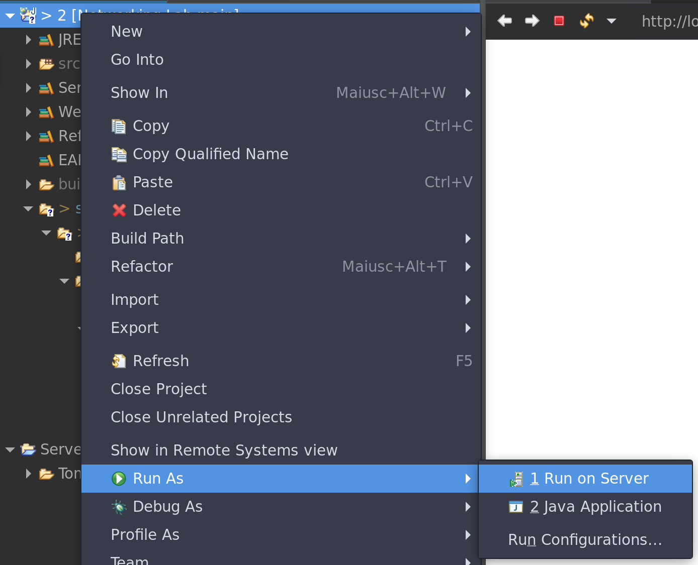

# eclipse dynamic web setup

## Needed plugins:
    -   Eclipse Java EE developer tools
    -   Eclipse Java Web developer tools
    -   Eclipse Web developer tools
    -   JST Server Adapters
    -   JST Server Adapter Extensions

## Servlet Mapping

in **web.xml** _({ProjName}/src/main/webapp/WEB-INF/web.xml)_ 

servlet-mapping tag maps the Mapping path point of the servlet on the dynamic webserver

    
    <servlet-mapping>
        <servlet-name>Data</servlet-name>
        <url-pattern>/Data</url-pattern>
    </servlet-mapping>
    

for instance the mapping will be *localhost:8080/PrimoProgetto/Data*
eclipse will add a new mapping automatically (to the web.xml) for each servlet class created

## Needed libs for JSTL

-   JSTL implementation (tomcat >= 9.0)
-   JSTL API (tomcat >= 9.0)


### First-step

Copy the 2 .jar lib files into the proj. lib folder.

dir: '{projName}/src/main/webapp/WEB-INF/lib'

### Second-step 

Adding libs to build path in eclipse ide (in WEB-INF/lib)


</img>

### Third-step

Touch an index.jsp file in '{projName}/src/main/webapp/index.jsp'

### Fourth-step

Ensure

```
<%@ taglib prefix="c"  uri="http://java.sun.com/jsp/jstl/core" %>
```

is included on top of index.jsp file

or, to stay safe

```
<%@ page language="java" contentType="text/html; charset=UTF-8" pageEncoding="UTF-8"%>
<%@ taglib prefix="c" uri="http://java.sun.com/jsp/jstl/core" %>    
<%@ taglib prefix="fmt" uri="http://java.sun.com/jsp/jstl/fmt" %>  
<!DOCTYPE html PUBLIC "-//W3C//DTD HTML 4.01 Transitional//EN" "http://www.w3.org/TR/html4/loose.dtd">


<html>
...
```


### Fifth-step

When on a new project ensure to run the code on tomcat through 'Run As' and not using the green run button on top (toolbar), or it would execute back an old random project.

</img>


## Free tomcat ports 

### Std one

<code>
    ss -ltnup | grep :8080
</code>
<br>
<code>   
    kill {pid}
</code>

### Oneliner-stuff
```
kill $(ss -ltnup | grep :8080 | cut -d' ' -f66 | cut -d',' -f2 | cut -d '=' -f2) && echo OK!
```
<!-- ah non ci sta il backtick ma $()? ESATTO! BENVENUTI NEL 2022 -->

(if kill rets "not enough args" then has already been killed, if echo's "OK!" then has just been killed)

## JSTL tags

### Table

<table class="table table-bordered">
<tbody><tr>
<th style="width:11%">S.No.</th>
<th style="text-align:center;">Tag &amp; Description</th>
</tr>
<tr>
<td style="text-align:center;vertical-align:middle;">1</td>
<td><a href="/jsp/jstl_core_out_tag.htm"> &lt;c:out&gt;</a>
<p>Like &lt;%= ... &gt;, but for expressions.</p>
</td>
</tr>
<tr>
<td style="text-align:center;vertical-align:middle;">2</td>
<td><a href="/jsp/jstl_core_set_tag.htm">&lt;c:set &gt;</a>
<p>Sets the result of an expression evaluation in a <b>'scope'</b></p>
</td>
</tr>
<tr>
<td style="text-align:center;vertical-align:middle;">3</td>
<td><a href="/jsp/jstl_core_remove_tag.htm">&lt;c:remove &gt;</a>
<p>Removes a <b>scoped variable</b> (from a particular scope, if specified).</p>
</td>
</tr>
<tr>
<td style="text-align:center;vertical-align:middle;">4</td>
<td><a href="/jsp/jstl_core_catch_tag.htm">&lt;c:catch&gt;</a>
<p>Catches any <b>Throwable</b> that occurs in its body and optionally exposes it.</p>
</td>
</tr>
<tr>
<td style="text-align:center;vertical-align:middle;">5</td>
<td><a href="/jsp/jstl_core_if_tag.htm">&lt;c:if&gt;</a>
<p>Simple conditional tag which evalutes its body if the supplied condition is true.</p>
</td>
</tr>
<tr>
<td style="text-align:center;vertical-align:middle;">6</td>
<td><a href="/jsp/jstl_core_choose_tag.htm">&lt;c:choose&gt;</a>
<p>Simple conditional tag that establishes a context for mutually exclusive conditional operations, marked by <b>&lt;when&gt;</b> and <b>&lt;otherwise&gt;</b>.</p>
</td>
</tr>
<tr>
<td style="text-align:center;vertical-align:middle;">7</td>
<td><a href="/jsp/jstl_core_choose_tag.htm">&lt;c:when&gt;</a>
<p>Subtag of <b>&lt;choose&gt;</b> that includes its body if its condition evalutes to <b>'true'</b>.</p>
</td>
</tr>
<tr>
<td style="text-align:center;vertical-align:middle;">8</td>
<td><a href="/jsp/jstl_core_choose_tag.htm">&lt;c:otherwise &gt;</a>
<p>Subtag of <b>&lt;choose&gt;</b> that follows the <b>&lt;when&gt;</b> tags and runs only if all of the prior conditions evaluated to <b>'false'</b>.</p>
</td>
</tr>
<tr>
<td style="text-align:center;vertical-align:middle;">9</td>
<td><a href="/jsp/jstl_core_import_tag.htm">&lt;c:import&gt;</a>
<p>Retrieves an absolute or relative URL and exposes its contents to either the page, a String in <b>'var'</b>, or a Reader in <b>'varReader'</b>.</p>
</td>
</tr>
<tr>
<td style="text-align:center;vertical-align:middle;">10</td>
<td><a href="/jsp/jstl_core_foreach_tag.htm">&lt;c:forEach &gt;</a>
<p>The basic iteration tag, accepting many different collection types and supporting subsetting and other functionality .</p>
</td>
</tr>
<tr>
<td style="text-align:center;vertical-align:middle;">11</td>
<td><a href="/jsp/jstl_core_foreach_tag.htm">&lt;c:forTokens&gt;</a>
<p>Iterates over tokens, separated by the supplied delimeters.</p>
</td>
</tr>
<tr>
<td style="text-align:center;vertical-align:middle;">12</td>
<td><a href="/jsp/jstl_core_param_tag.htm">&lt;c:param&gt;</a>
<p>Adds a parameter to a containing <b>'import'</b> tag's URL.</p>
</td>
</tr>
<tr>
<td style="text-align:center;vertical-align:middle;">13</td>
<td><a href="/jsp/jstl_core_redirect_tag.htm">&lt;c:redirect &gt;</a>
<p>Redirects to a new URL.</p>
</td>
</tr>
<tr>
<td style="text-align:center;vertical-align:middle;">14</td>
<td><a href="/jsp/jstl_core_url_tag.htm">&lt;c:url&gt;</a>
<p>Creates a URL with optional query parameters</p>
</td>
</tr>
</tbody></table>
