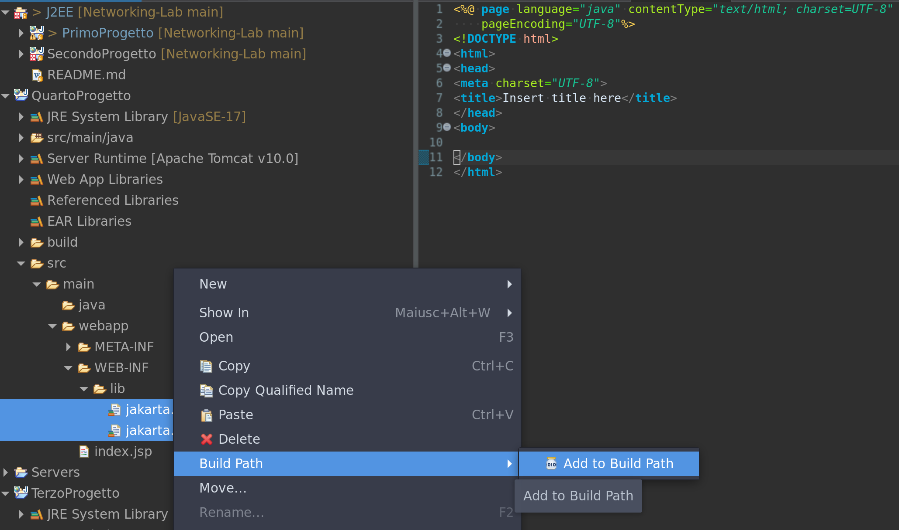

# eclipse dynamic web setup

## Needed plugins:
    -   Eclipse Java EE developer tools
    -   Eclipse Java Web developer tools
    -   Eclipse Web developer tools
    -   JST Server Adapters
    -   JST Server Adapter Extensions

## Servlet Mapping

in **web.xml** _({ProjName}/src/main/webapp/WEB-INF/web.xml)_ 

servlet-mapping tag maps the Mapping path point of the servlet on the dynamic webserver

    
    <servlet-mapping>
        <servlet-name>Data</servlet-name>
        <url-pattern>/Data</url-pattern>
    </servlet-mapping>
    

for instance the mapping will be *localhost:8080/PrimoProgetto/Data*
eclipse will add a new mapping automatically (to the web.xml) for each servlet class created

## Needed libs for JSTL

-   JSTL implementation (tomcat >= 9.0)
-   JSTL API (tomcat >= 9.0)

### Adding libs to build path in eclipse ide (in WEB-INF/lib)

</img>

## Free tomcat ports 

<code>
    ss -ltnup | grep :8080
</code>
 
<code>   
    kill {pid}
</code>
