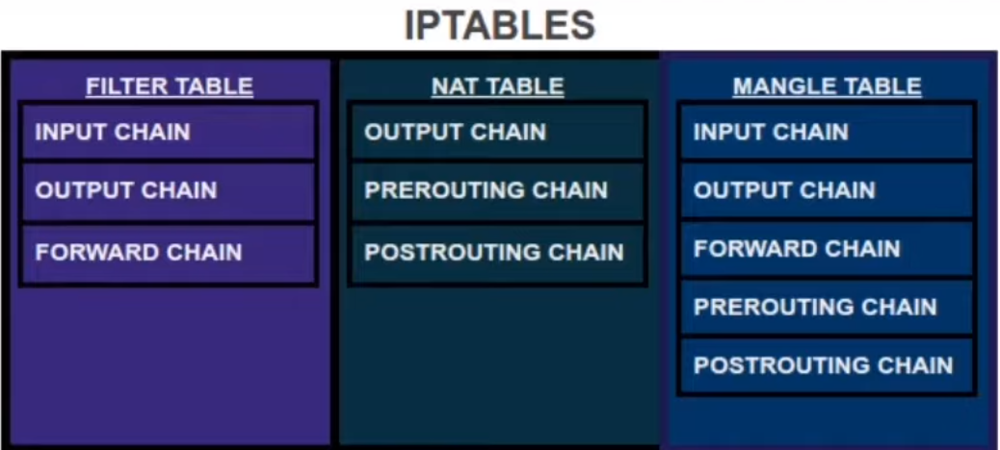

- [***Procedim. (comandi + path rilevanti)***](#procedim-comandi--path-rilevanti)
  - [***Assegnamento hostname***](#assegnamento-hostname)
  - [***Interfacce di rete***](#interfacce-di-rete)
    - [***Intro***](#intro)
    - [***Visualizzare configurazione***](#visualizzare-configurazione)
    - [***Tipi di configurazione***](#tipi-di-configurazione)
      - [***Statica***](#statica)
      - [***Dinamica***](#dinamica)
        - [***Configurazione***](#configurazione)
      - [***Config macchine***](#config-macchine)
    - [***Troubleshooting***](#troubleshooting)
  - [***VLAN***](#vlan)
    - [***1 step: creazione VLAN sullo switch***](#1-step-creazione-vlan-sullo-switch)
      - [***net design***](#net-design)
      - [***config switch vde***](#config-switch-vde)
    - [***2 step: config VLAN sulle macchine***](#2-step-config-vlan-sulle-macchine)
  - [***Gateway***](#gateway)
    - [**Default gateway**](#default-gateway)
    - [**Tipi gateway**](#tipi-gateway)
      - [**host-through**](#host-through)
      - [**subnet-through**](#subnet-through)
  - [***Traffic Shaping***](#traffic-shaping)
    - [***Trasferire file prova per test banda***](#trasferire-file-prova-per-test-banda)
  - [***Firewalling***](#firewalling)
- [***Comandi evergreen***](#comandi-evergreen)


# ***Procedim. (comandi + path rilevanti)***

## ***Assegnamento hostname***
`hostname` mostra l attuale hostname

in `/etc/hostname/` lo cambiamo permanentemente

_ESEMPIO:_
```
127.0.0.1 localhost
192.168.1.1 h1
192.168.1.2 h2
```
## ***Interfacce di rete***

### ***Intro***

La configurazione avviene in: `/etc/network/interfaces`

<details>
<summary>Note e comandi ifup&ifdown</summary>
All'avvio del sistema, se non è presente la direttiva auto nei file di configurazione opportuni, l'interfaccia di rete sarà spenta.Per attivare l'interfaccia configurandola utilizzando i file di configurazione, utilizzare i comandi:

  - `ifup {interfaccia}`
  - `ifdown {interfaccia}`
</details>

### ***Visualizzare configurazione***

`ifconfig [-a] [<name>]`

Se non viene specificata nessuna interfaccia, vengono mostrate tutte le interfacce attive. Usando l'opzione -a vengono visualizzate anche le interfacce non attive.

### ***Tipi di configurazione***
#### ***Statica***

-   address = indirizzo IP dell'interfaccia (192.168.X.Y)
-   netmask = 255.255.255.0
-   network = indirizzo della rete (192.168.X.0)
-   broadcast = indirizzo di broadcast (192.168.X.255)
-   gateway = default gateway, da utilizzare nel caso la configurazione di rete lo richieda

_ESEMPIO:_

```
auto eth0
iface eth0 inet static
    address 192.168.1.1
```

(dopo eseguire ifup eth0 per accenderla)


#### ***Dinamica***

<details>
<summary>DCHP cos'è?</summary>
Protocollo per gestire la configurazione dei nodi alla loro connessione, funzionamento:
- Il nodo (client) appena connesso non sa come deve configurarsi
- Manda una richiesta generica “alla rete”
- La rete invia i parametri di configurazione
</details>

##### ***Configurazione***

Una macchina può avere indirizzo fisso come h3 qui sotto, in questo modo avrà il suo indirizzo ip riservato leggendo il mac address.

Le altre macchine invece avranno un ip dal pool definito dal range.


<h3><b> DCHP - setupp </b></h3>

Installo pacchetto

`sudo apt-get install isc-dhcp-server`


Guarda dove stanno i file di config:

`/etc/dhcp/dhcpd.conf`

`/etc/default/isc-dhcp-server`

Avviare il server DHCP

`service isc-dhcp-server start`

Fare l enable da systemd (amato da tutti)

`systemctl enable isc-dhcp-server`

<h3><b> Parametri generali </b></h3>

```
# dominio della rete
option domain-name "retilab.org";

# server DNS
option domain-name-servers <ip_macchina_server>;

# autorevolezza
authoritative;

# Lease time
default-lease-time 600;
max-lease-time 7200;

# Logging
log-facility local7;


# configurazione di una sottorete
shared-network 192-168-1 {
    subnet 192.168.1.0 netmask 255.255.255.0 {
      # parametri per la sottorete andrebbero qui
      option routers 192.168.1.254;
        }
        # range di indirizzi disponibili
        pool {
          range 192.168.1.10 192.168.1.19;
          }
      }

host client3 {
    # indirizzo mac preso da marionnet
    hardware ethernet 02:04:06:11:22:33;
    fixed-address 192.168.1.3;
  }
```

#### ***Config macchine***

in `/etc/network/interfaces`

hwaddress forzato alla 3a linea

```
auto eth0
iface eth0 inet dhcp
    hwaddress ether 02:04:06:11:22:33
```

ciò va fatto per ogni macchina, se una macchina ha un fixed ip address questo va messo nella dhcp config nell ultimo blocco di parentesi.

### ***Troubleshooting***

***Riavvio servizi di rete:*** `service networking restart`

**Attivazione/disattivazione dell'interfaccia di rete senza leggere alcun file di configurazione:** `ifconfig <iface> {up,down}`

**In generale:** Provare a fare a caso ifdown ed ifup


## ***VLAN***

### ***1 step: creazione VLAN sullo switch***

#### ***net design***

Non serve il cavo cross, va usato solo per interconnettere 2 host.


#### ***config switch vde***

Andare sullo switch->modifica e cambiare la vde startup configuration (altrimenti verrebbe resettato ad ogni riavvio)

**crea vlan**: `vlan/create vlan_number`  

**associa porte esclusivamente untagged / port based / access link**: `port/setvlan port_number vlan_number`  

**associa porte esclusivamente tagged / tag based / trunk link**: `vlan/addport vlan_number port_number`

**stampa config**: `vlan/print`

### ***2 step: config VLAN sulle macchine***

in `/etc/network/interfaces`

DA USARE: ?

_ESEMPIO:_
```
inserisci esempio, serve anche la eth0 normale oltre la eth0.30? boh
```

## ***Gateway***

<details>
<summary>Cos'è</summary>
Allo scopo di fare comunicare delle sottoreti, si individuano degli host che svolgono il ruolo di router, che inoltrano pacchetti da una sottorete a un'altra.

  -   il router riceve un pacchetto con un indirizzo IP destinazione non suo e, invece di scartarlo (azione comune di un host), lo inoltra secondo regole di routing
  -   ogni host deve conoscere quali sono i router a cui può inviare i pacchetti nel caso in cui i destinatari non facciano parte della sua sottorete, e li identifica con il termine di gateway
  -   è impostabile un default gateway per tutte le destinazioni target che non soddisfano nessuna delle destinazioni presenti nella tabella di routing
</details>


### **Default gateway**

si imposta in `/etc/network/interfaces`

_ESEMPIO_

```
iface eth0 inet static
    address 192.168.1.1
    netmask 255.255.255.0
    gateway 192.168.1.254
```


### **Tipi gateway**


#### **host-through**

In `/etc/network/interfaces` 

`post up route add -host <target> gw <gwaddr>`

#### **subnet-through**

In `/etc/network/interfaces` 

`post up route add -net <target> gw <gwaddr>`

Consultare tabella di routing: `route -n` sull'host.


_ESEMPIO:_
```
iface eth0 inet static
  address 192.168.1.1 
  netmask 255.255.255.0
  gateway 192.168.1.254
  post-up route add -net 192.168.2.0 netmask 255.255.255.0 gw 192.168.1.253
```


**Abilitare ip forwarding:**

Per abilitarla permanentemente, impostare a 1 il campo _net.ipv4.ip_forward_ nel file `/etc/sysctl.conf`. In questo caso, riavviare networking o usare: `sysctl -p /etc/sysctl.conf`

Routing verso un host: route add -host <target> gw <gwaddr>Routing verso una subnet:# route add -net<target>gw <gwaddr>Impostazione del default gateway:# route add default gw <gwaddr>


## ***Traffic Shaping***

<details>
<summary> Teoria </summary>

**qdisc**: queueing discipline (disciplina di coda)

Classless qdiscs:
- pfifo_fast: default
- tbf: Token Bucket Filter
- sfq: Stochasting Fairness Queuing
- red: Random Early Detection
- codel, fq_codel: Controlled Delay

</details>

Se si vuole rallentare h1>h2 questo comando va eseguito su h1

`tc qdisc add dev <iface>  {root,parent <handle>} {disciplina, come tbf} rate <rate> burst <burst> latency <latency>`


_ESEMPIO_

`tc qdisc add dev eth0 root tbf rate 1Mbit burst 10000 latency 50`


### ***Trasferire file prova per test banda***

Creo il file: `dd if=/dev/zero of=file.bin bs=1M count=1`

_H2>H1_

(apro porta 8080)

**H2:** `nc -l -p 8080 > /dev/null`

**H1:** `time sh -c “cat file.bin | nc 192.168.1.2 8080 -q1”`


## ***Firewalling***

<a href="http://web.mit.edu/rhel-doc/3/rhel-rg-it-3/s1-iptables-options.html"> Sito +100 iptables </a>


<details>
  <summary>
  IMG Esplicativa iptables
  </summary>

</details>

Per le operazioni di packet filtering si usa la tabella Filter, che contiene tre catene:
- _INPUT:_ contiene le regole per i pacchetti destinati ad un  processo locale
- _OUTPUT:_ contiene le regole per i pacchetti diretti verso  l’esterno
- _FORWARD:_ contiene le regole per i pacchetti in transito

lista regole: `iptables -L`

cancela regole: `iptables -D [chain] [number]`

struttura:  `iptables[-t tabella] -P catena { ACCEPT | DROP }`

`-P`: definisce la politica


_ESEMPI:_

- `iptables–t filter –P INPUT DROP`
- `iptables–t filter –P FORWARD ACCEPT`

<h3> BLOCCARE PORTE </h3>

`iptables -I`


# ***Comandi evergreen***

-   attiviamo l'interfaccia eth0

    `ifconfig eth0 up  `

-   generiamo richieste arp

    `arping -i eth0 {indirizzo_ip}`

-   “sniffiamo” il traffico arp su eth0

    `tcpdump -ni eth0 arp`

-   Mostra la configurazione di quella macchina dato l ip e l interfaccia di rete
   
    `ifconfig eth0 XXX.XXX.X.X`

  


Made with &hearts; from <a href="https://www.gmichele.it">MG</a>